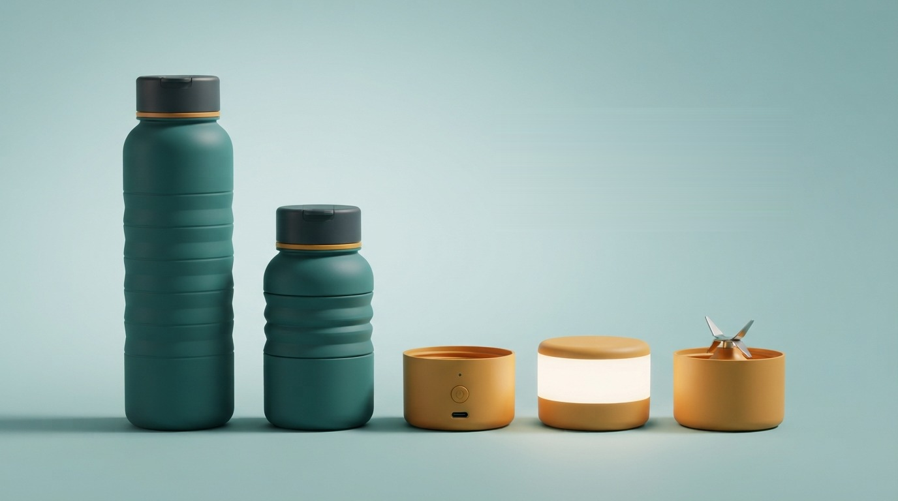

# FlexBottle

A concept e-commerce storefront for **FlexBottle** — a collapsible water bottle that folds flat, locks with a twist, and swaps its base for a power bank, a lamp, or a personal blender.



> This is a course project. It's a fully working storefront UI, but checkout is a demo flow — no real payment is processed and no product ships.

## Features

- **Home, Shop, Product, Cart & Checkout** pages built with the Next.js App Router
- **Live multi-currency pricing** (USD / THB / SAR / JPY) via a header selector, persisted per visitor
- **Cart** with a slide-over drawer and a full cart page, persisted in `localStorage`
- **Product gallery** with multiple images per product (e.g. the bottle extended vs. folded)
- Responsive, accessible UI built on **shadcn/ui** components

## Tech stack

- [Next.js](https://nextjs.org) (App Router, TypeScript)
- [Tailwind CSS v4](https://tailwindcss.com)
- [shadcn/ui](https://ui.shadcn.com) on top of [Base UI](https://base-ui.com) primitives
- Product photography generated with AI image tools, art-directed and post-processed for the site

## Getting started

```bash
npm install
npm run dev
```

Open [http://localhost:3000](http://localhost:3000) to see it.

## Project structure

```
src/
  app/            routes: /, /shop, /product/[slug], /cart, /checkout, /about, /contact
  components/     UI components (cart, currency switcher, product card/gallery, shadcn/ui)
  lib/            product catalog data, currency conversion
public/products/  product photography
```
